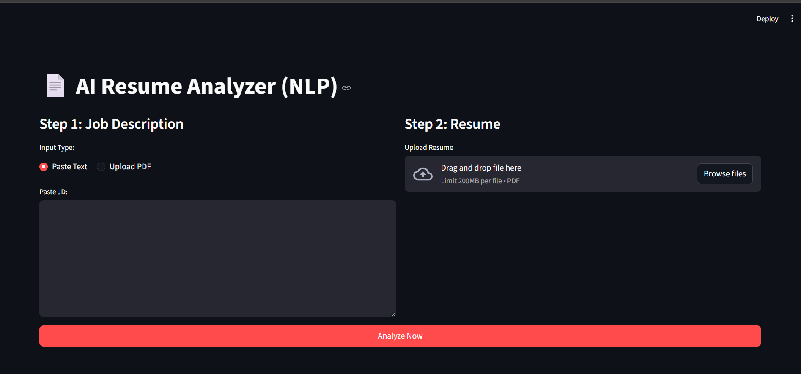
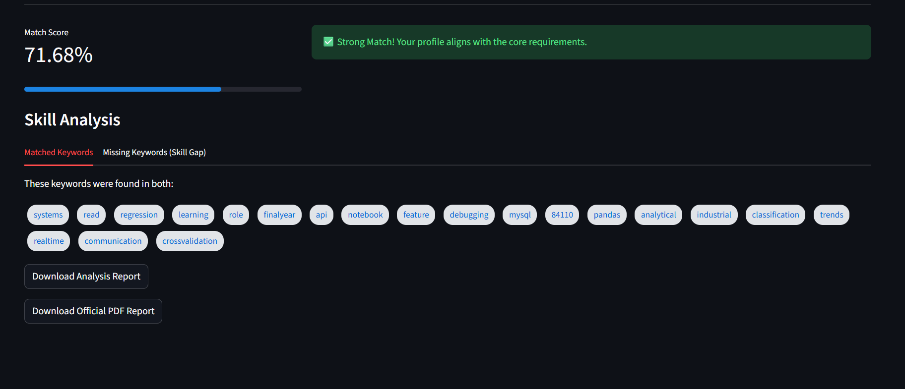

# 📄 AI Resume Analyzer (NLP-Powered)

An intelligent Resume Screening tool built with **Python**, **SpaCy**, and **Streamlit**. This application uses Natural Language Processing (NLP) to parse resumes, identify key entities, and calculate a similarity score against Job Descriptions.


## 🚀 Live Demo
**Check out the live app here:** [PASTE_YOUR_STREAMLIT_URL_HERE]

## ✨ Key Features
* **PDF Text Extraction:** Seamlessly extracts text from PDF resumes using `PyPDF2`.
* **NLP Entity Recognition:** Identifies Names, Organizations, and Locations using **SpaCy's NER**.
* **Skill Gap Analysis:** Automatically detects missing technical keywords using **Set Theory logic**.
* **ATS Scoring:** Calculates a Match Score (%) using **TF-IDF Vectorization** and **Cosine Similarity**.
* **Professional PDF Reports:** Generates a downloadable, formatted PDF audit report using `fpdf`.
* **Responsive UI:** Interactive dashboard built with Streamlit.

## 🛠️ Tech Stack
* **Language:** Python 3.10+
* **NLP:** SpaCy (`en_core_web_sm`), Scikit-learn (TF-IDF)
* **Frontend:** Streamlit
* **Backend:** Regex, String manipulation
* **Reporting:** FPDF

## 📸 Screenshots

*Figure 1: Main Dashboard with JD and Resume upload columns.*


*Figure 2: Match Score and Skill Gap tags.*

## ⚙️ Local Installation

1. **Clone the repository:**
   ```bash
   git clone [https://github.com/YOUR_USERNAME/Resume-Analyzer.git](https://github.com/YOUR_USERNAME/Resume-Analyzer.git)
   cd Resume-Analyzer
   ```
Set up Virtual Environment:Bashpython -m venv venv
## Activate Windows:
```bash
venv\Scripts\activate
```
## Activate Mac/Linux:
```bash
source venv/bin/activate
```
## Install Dependencies:
```bash
pip install -r requirements.txt
python -m spacy download en_core_web_sm
```
## Run the App:
```bash
streamlit run src/app.py
```
## 🧠 How it WorksPreprocessing: 
*  Cleans text by removing URLs, punctuation, and non-ASCII characters.Vectorization: Converts the Job Description and Resume into numerical vectors using TF-IDF.
*  Similarity: Measures the cosine of the angle between the two vectors ($$Cosine\ Similarity = \frac{A \cdot B}{||A|| ||B||}$$) to determine the match percentage.
*  Gap Analysis: Compares keyword sets to find what specific skills the candidate is missing.Developed by: Subhankar ChandYear: 2026
---


